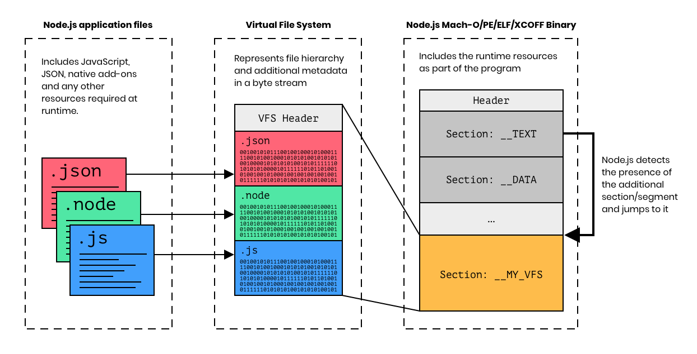
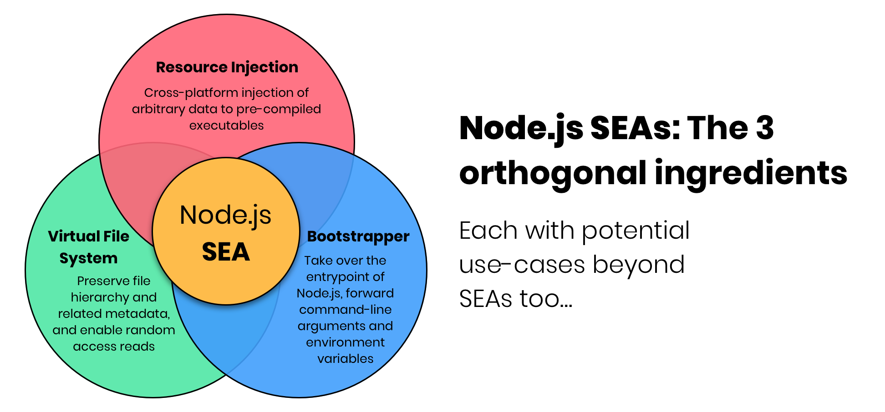

An Overview of the Current State
================================

Authors: 
[@dsanders11](https://github.com/dsanders11),
[@jviotti](https://github.com/jviotti),
[@guest271314](https://github.com/guest271314),
[@RaisinTen](https://github.com/RaisinTen),
[@robertgzr](https://github.com/robertgzr),
[@saswatds](https://github.com/saswatds),
[@Trott](https://github.com/Trott).

> This document aims to provide a short introduction to the problem and our
> current understanding of the desired solution. The objective is to set the
> minimal ground for further discussion rather than providing extensive
> details. Reach out through [GitHub
> Discussions](https://github.com/nodejs/single-executable/discussions) if you
> have any questions!

Introduction
------------

A Node.js Single Executable Application (SEA) is a full Node.js program
distributed with the Node.js runtime as a single standalone binary.  The
problem of bundling app code with the Node.js platform runtime has been
explored by the Node.js community for many years as documented in [Existing SEA
Solutions](../docs/existing-solutions.md).  What it is even more interesting,
is that variants of at least one facet of same problem have also been explored
by the general open-source community in projects such as
[Deno](https://deno.land/manual/tools/compiler),
[AppImage](https://appimage.github.io),
[Electron](https://github.com/electron/asar) and
[Redbean](https://redbean.dev).

While there are many good solutions to this problem in the Node.js ecosystem,
none of them has proven to be strictly superior than the rest. Many of these
tools implement similar architectures, often end up solving the same problems
and as a consequence tend to face the same challenges.

We believe that joining forces will not only result in a superior solution in
the context of Node.js, but also introduce foundational blocks to solve related
problems in the open-source world at large.

How do SEAs work?
-----------------

The problem of combining application resources with a Node.js executable may
seem daunting at first, but it's not! The process typically looks something
like this:

First, we start with the assets that make a Node.js application. These
typically consist of JavaScript files from the application code and
`node_modules` directory, any native add-on built by either the top-level
application or any of its dependencies, JSON files and more. Code implemented
using transpilers like TypeScript or compiled to JavaScript through WebAssembly
are assumed to have been already processed at this point.

Node.js programs are often composed by more than one file. To embed these
multiple files into the executable, we need to "bundle" them together.
Application code may rely on file-system characteristics such as their location
relative to the root of the project, the permissions added to the application
files (i.e. the execution bit) or a symlink-based directory structure.  To make
sure these characteristics are preserved, application files are often bundled
as a Virtual File System (VFS).

Native executable programs, objects, shared libraries and static libraries are
represented using a binary format understood by the operating system.  For
example, macOS and Windows make use of the
[Mach-O](https://en.wikipedia.org/wiki/Mach-O) and [Portable Executable
(PE)](https://en.wikipedia.org/wiki/Portable_Executable) binary formats,
respectively. These binary formats typically organize their data as a set of
sections. For example, one section may include the main executable code of the
program while another section may include every statically initialized
variable.

Therefore, the Virtual File System obtained by bundling the application files
can be "appended" to the Node.js binary as a new section.  The Node.js C++
native initialization logic can introspect on which sections it contains, and
jump execution to the VFS section if available.

Problems with current SEAs
--------------------------

In our experience, existing Node.js single-executable implementations have at
least one of the following problems or limitations:

- **Require maintaining custom Node.js patches.** These patches typically touch
  on the initialization logic of Node.js and are different across Node.js
  versions. These patches result in high maintenance burden and make it
  difficult for SEA implementations to support new Node.js versions as soon as
  they are released. The ideal SEA tool must be able to create a standalone
  executable application using any upstream Node.js build published to the
  official website.
- **Require building Node.js from source.** Managing custom Node.js patches
  also means that SEA implementations need to provide its own custom builds of
  Node.js.  Operating custom builds is complex, error-prone and potentially
  expensive resources-wise. In other cases, SEA projects embed the application
  resources at build time, pushing the need of building Node.js from source to
  their users.
- **Require monkey-patching Node.js internal modules.** Often, SEA
  implementations need to intercept I/O related Node.js functionality ranging
  from the `fs` and `child_process` module, to the inner workings of
  `require()`. Node.js does not provide facilities to aid in this problem,
  resulting in complex and error-prone monkey patching.
- **Limited interoperability with code signing.** In many cases, the
  application resources are embedded at the tail of the binary, outside of the
  boundaries of binary formats such as Mach-O and PE. Given that code-signing
  operates at the binary format level, these approaches can result in binaries
  that cannot be code-signed, that cannot be executed, or signed binaries whose
  application resources are actually not protected by the signature.
- **No support for non-JavaScript assets.** Some SEA implementations
  concatenate JavaScript assets and inject the resulting "single" file into the
  executable. While this approach works for simple programs, many Node.js
  applications require application resources that are not typically
  concatenated as part of the JavaScript code, such as Node.js native add-ons,
  text files, executable scripts and more. These assets are often dynamically
  consumed using `fs` and `child_process`.
- **Partial coverage of the platforms supported by Node.js.** Node.js provides
  official support, of varying degrees, for a [wide
  range](https://github.com/nodejs/node/blob/08d6a82f62962015b03ae7076487ba209cfd2ab5/BUILDING.md#supported-platforms)
  of operating systems and architectures. In comparison, many SEA
  implementations limit their support to a small subset of these.

The Architecture of SEAs
------------------------

The problem of supporting Node.js SEAs can be broken down as the sum of 3
complementary and orthogonal ingredients: the **Resource Injection**, the
**Virtual File System** and the **Bootstrapper**. Interestingly enough, these
components are generic enough that they may each open up use cases beyond SEAs
too.

### Resource Injection

This ingredient is concerned with providing the ability to inject arbitrary
data to a pre-compiled binary on a binary-format-friendly manner. After the
data injection takes place, the program must be able to detect the offset and
length of the injected data at runtime. Implementing a cross-platform resource
injector and supporting the capability for runtime introspection requires
knowledge of various binary formats.

The initial set of requirements for this ingredient are:

| # | Requirement                                                                                 |
|---|---------------------------------------------------------------------------------------------|
| 1 | Inject data within the boundaries of the binary format, not outside of it                   |
| 2 | Support every binary format adopted by the platforms supported by Node.js                   |
| 3 | Support the injection of any arbitrary data, irrelevant of its format and contents          |
| 4 | Provide a complementary cross-platform native API for runtime reflection                    |
| 5 | The injector implementation must not require native add-ons                                 |
| 6 | Allow injection to any supported binary format in any platform (from macOS to Windows, etc) |

The purpose of requirement #5 is to prevent developers making use of the SEA
technology from needing to have a full native compiler toolchain on their local
environments to build a native add-on that enables injection. This setup is
often complicated on i.e. Windows and would likely become a common source of
issues asking for help.

Requirement #6 is a convenience feature primarily used in Continuous
Integration. With it, developers do not need to perform data injection using a
host operating system that matches the target.  For example, a developer would
be able to perform resource injection to a Windows binary on Linux.

While the immediate use case for this tool is to inject Node.js resource files
into the main executable, many native programs find the need of injecting
arbitrary data files into the program for a wide number of reasons. Features
such as [`#embed`](https://thephd.dev/finally-embed-in-c23) have landed in the
C23 programming language for this reason.

### Virtual File System

The VFS is the read-only format in which the application data is bundled before
getting injected into the Node.js executable. The presence of a VFS is
essential for supporting runtime logic that relies on file-system metadata such
as directory structure and file permissions. This type of VFS format is
typically simple: a concatenation of the files along with some structure that
annotates each file with file-system-related metadata. 

The initial set of requirements for this ingredient are:

| # | Requirement                                                             |
|---|-------------------------------------------------------------------------|
| 1 | Support random access reads for performance reasons                     |
| 2 | Support the concept of symbolic links                                   |
| 3 | Support preserving file permissions, at least the executable bit        |
| 4 | Support general purpose data compression for space optimization reasons |
| 5 | Preserve file-hierarchy information                                     |
| 6 | Increase locality of related files for performance reasons              |
| 7 | No interference with valid paths in the file system                     |

A virtual file system has wide applicability beyond being embedded into an
existing executable. Use cases range from virtual machines and data
transmission, to even [package
managers](https://github.com/yarnpkg/berry/tree/b6273b3f393f1485b810ee09a66acd5b2af564dd/packages/yarnpkg-fslib).

### Bootstrapper

This is the ingredient that ties it all together. The bootstrapper makes use of
the *Resource Injection* runtime introspection capability to detect the
presence of the embedded *Virtual File System*. It implements the logic for
jumping execution into the program bundled in the virtual file system and knows
how to intercept I/O to the virtual file system to provide seamless execution.

The initial set of requirements for this ingredient are:

| # | Requirement                                                       |
|---|-------------------------------------------------------------------|
| 1 | Support loading Node.js native add-ons                            |
| 2 | Proxy Node.js API function calls that involve I/O back to the VFS |
| 3 | Support running executable programs from within the VFS           |
| 4 | Proxy command-line arguments to the program embedded in the VFS   |
| 5 | Proxy environment variables to the program embedded in the VFS    |

In the context of Node.js, the community was historically forced to
monkey-patch modules such as `fs` for advanced I/O use cases. For example,
Electron
[monkey-patches](https://github.com/electron/electron/blob/06a00b74e817a61f20e2734d50d8eb7bc9b099f6/lib/asar/fs-wrapper.ts)
several Node.js modules to power their ASAR integration. Vercel's PKG
[monkey-patches](https://github.com/vercel/pkg/blob/f0c4e8cd113e761958ab387f4b0237f4d8797335/prelude/bootstrap.js#L596)
a wide range of functions in a similar way. This approach is not only
error-prone, but might not be possible in the future if Node.js prevents
runtime modification to its internal modules (i.e. for security reasons).

What do we have so far?
-----------------------

At Postman, [@dsanders11](https://github.com/dsanders11),
[@raisinten](https://github.com/raisinten) and
[@robertgzr](https://github.com/robertgzr) made outstanding progress on
experimenting with the above architecture. Much of this progress builds on the
interesting previous work and discussions that took place in
[#42334](https://github.com/nodejs/node/pull/42334) and
[#43432](https://github.com/nodejs/node/issues/43432).

In the area of *Resource Injection*, we open-sourced a tool called
[Postject](https://github.com/postmanlabs/postject). Postject enables arbitrary
injection of data as Mach-O, PE and ELF sections, and ships with a
cross-platform C/C++ header file providing runtime introspection APIs. It is
currently implemented in a mixture of Python and C++, and it builds on the
foundations provided by the [LIEF](https://github.com/lief-project/LIEF)
project.

In the area of *Virtual File Systems*, we are currently basing our
proof-of-concept on the [ASAR](https://github.com/electron/asar) archive format
designed and battle-tested by Electron. The ASAR format is extensible by
design, allowing us to add arbitrary new metadata and functionality to our
custom implementation.

In the area of the *Bootstrapper*, we are maintaining a custom Node.js patch
that makes use of Postject reflection APIs, provides a basic ASAR read-only
implementation, and takes over the entry point of Node.js to jump execution to
the embedded app.

However, we are far from done! Our goal is to rethink and continue evolving
these components with the help of the community, and push for a better approach
to SEAs that everybody from the Node.js ecosystem and beyond can benefit from.

Future work
-----------

SEAs open interesting possibilities for innovation. For example, we can explore
creating SEAs that make use of v8 snapshots to speed up application startup
time, or ways in which we can trim down Node.js to optimize for
space-efficiency in the context of SEAs.

Ideas are very welcome!

Taking it from here
-------------------

There are lots of ways to help! If you made it this far, you probably have some
questions, observations and feedback. If so, do write them down as [GitHub
Discussions](https://github.com/nodejs/single-executable/discussions) or
[GitHub Issues](https://github.com/nodejs/single-executable/issues). Other than
that:

- We need to collect proper requirements for each of the components we will be
  building
- We need to continue researching what's out there, and what we can learn from
  it
- We need to align implementers of SEA tooling to join forces and create a
  top-notch technology
- We need to sort out philosophical questions about how much of the SEA work
  will be a proper part of the core Node.js project, and how much will be
  community tooling

Last but not least, we have to actually write some code and get this done!
